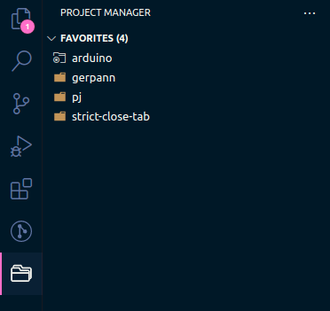

**Visual Studio Code** a.k.a **VS Code**, released by ***Microsoft***, is one of the most popular open source code editors for developers.

**VS Code** helps developers increase productivity in the execution of projects. One of the reasons make **VS Code** popular is its variety of available extensions in <a href="https://marketplace.visualstudio.com/VSCode" target="_blank" rel="noreferrer">marketplace</a>.

Today, I am going to list some extensions that I usually use.


<!--truncate-->

_Note: The below extensions are useful for the most developers in any field, not just for Web App or Embedded developers. So in the future I will have other articles about extensions suitable for specific areas._

They are:

- [GitLens](#gitlens)
- [Visual Studio IntelliCode](#visual-studio-intellicode)
- [Project Manager](#project-manager)
- [vscode-icons](#vscode-icons)
- [Bracket Pair Colorizer 2](#bracket-pair-colorizer-2)
- [indent-rainbow](#indent-rainbow)

## GitLens

**VS Code** has already integrated built in `git` GUI, it's very helpful for developers because nowaday `git` is absolutely necessary for them.


When working with other team members, GitLens is a very good choice with its features:

- Revision navigation through file history.
- A current line blame annotation at the end of the line showing the commit.
- A status bar blame annotation for the commit and author who last modified the current line.

You can find it <a href="https://marketplace.visualstudio.com/items?itemName=eamodio.gitlens" target="_blank" rel="noreferrer">here</a> (in Visual Studio Code marketplace).

## Visual Studio IntelliCode

At the time I write this article, `Visual Studio IntelliCode` extension has the 8th most downloads in marketplace. So it became indispensable for developers.


This extension helps us writing code quickly by adding a star before the code snippets (it means this code had used very very much before by developers over the world).

You can install this extension <a href="https://marketplace.visualstudio.com/items?itemName=VisualStudioExptTeam.vscodeintellicode" target="_blank" rel="noreferrer">here</a>.

## Project Manager

Normally, each project is a `folder/directory` of your OS. Each time you want to open your project, you have to open the corresponding `folder/directory` and of course, you have to remember its path.

When the number of your projects increases, or you save them in a disorganized manner, you usually forget where they locate.


This problem can be easily solved with `Project Manager` extension. You can save your projects like folder/directory or even your workspaces. Your projects will be visible in the side bar like this



You can install this extension <a href="https://marketplace.visualstudio.com/items?itemName=alefragnani.project-manager" target="_blank" rel="noreferrer">here</a>.

## vscode-icons

This extension is just an `icon theme` for **VS Code**. It supplies icon for the folders/directories and files in the explorer sidebar of **VS Code**.


There are many good choice `icon theme` for us at marketplace, the reason why I recommend this because `vscode-icons` is the official extension of `Microsoft` (who made **VS Code**).

You can install this extension <a href="https://marketplace.visualstudio.com/items?itemName=vscode-icons-team.vscode-icons" target="_blank" rel="noreferrer">here</a>.

Of course, you can easily find out for your favorite themes at marketplace by type `icon` into the search input. The next step you just select and install them.

## Bracket Pair Colorizer 2 (deprecated)

> _Note: This extension is now deprecated and no longer being supported. Instead, this is now a built in feature of `**VS Code**`._
> Have you ever known about _LISP_?


When your code block increase too big, you use too many brackets, you difficultly find the rights bracket pairs, this extension will help you.

Look at this image and you will understand how it works


~~You can install this extension <a href="https://marketplace.visualstudio.com/items?itemName=CoenraadS.bracket-pair-colorizer-2" target="_blank" rel="noreferrer">here</a>.~~ (deprecated).

Now you can enable `Black pair colorizer` as a native feature in `**VS Code**`.

Just open your `settings.json` of your `**VS Code**` and add two following lines:

```json
{
  ...
  ​"editor.bracketPairColorization.enabled"​: ​true​,
  ​​"editor.guides.bracketPairs"​: ​"active"​,
  ...
}
```

## indent-rainbow

Like `Bracket Pair Colorizer 2`, `indent-rainbow` help us easily when see the code blocks, especially for `Python` developer


You can install this extension <a href="https://marketplace.visualstudio.com/items?itemName=oderwat.indent-rainbow" target="_blank" rel="noreferrer">here</a>.

_Note: the last both extensions can be customized, you should read their documents at their homepage to continue._

These are the best extensions for me, and it totally from my opinion, so if you know more helpful extensions, recommend for us!
