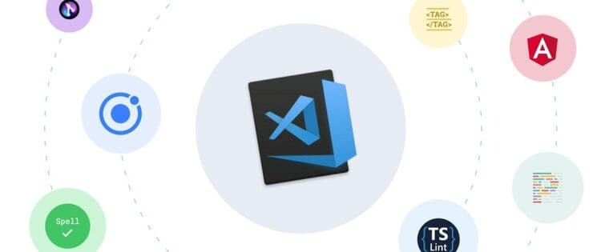

**Visual Studio Code** hay **VS Code**, được phát hành bởi **_Microsoft_**, là một trong những công cụ soạn thảo code tốt nhất hiện nay

**VS Code** giúp các lập trình viên tăng năng suất trong quá trình làm việc với source code. Một trong những lý do khiến **VS Code** trở nên phổ biến là sự đa dạng của các extension có sẵn trong <a href="https://marketplace.visualstudio.com/VSCode" target="_blank" rel="noreferrer">marketplace</a>.

Hôm nay, mình sẽ liệt kê một số extension mà mình thường sử dụng và thấy hữu ích :D.



<!--truncate-->

_Lưu ý: Các extension dưới đây hữu ích cho hầu hết các lập trình viên trong hầu hết lĩnh vực liên quan đến code, không chỉ cho lập trình viên Web App hay nhúng,... . Vì vậy trong tương lai mình sẽ có những bài viết khác về các extension phù hợp với các lĩnh vực cụ thể nếu được các bạn ủng hộ ^^._

Các extension nào nhỉ?

- [GitLens](#gitlens)
- [Visual Studio IntelliCode](#visual-studio-intellicode)
- [Project Manager](#project-manager)
- [vscode-icons](#vscode-icons)
- [Bracket Pair Colorizer 2](#bracket-pair-colorizer-2)
- [indent-rainbow](#indent-rainbow)

## GitLens

**VS Code** đã tích hợp sẵn `git` với giao diện cơ bản (`GUI`), nó rất hữu ích cho các lập trình viên vì hiện nay `git` là một trong những công cụ không thể thiếu.

Tuy nhiên, `git` có rất nhiều tính năng mà `GUI` trên **VS Code** không thể hỗ trợ. Ví dụ như `git blame` hay `git log`, hay xem lịch sử thay đổi của một file, người commit,... .

Do đó, `GitLens` ra đời để bổ sung những tính năng đó ngay trong **VS Code**.


Khi làm việc với các thành viên khác trong nhóm, `GitLens` là một lựa chọn tuyệt vời với những tính năng như:

- Di chuyển đến các phiên bản khác nhau của một file.
- So sánh 2 phiên bản khác nhau của một file.
- So sánh 2 nhánh khác nhau.
- Hiển thị thông tin commit của dòng hiện tại ở cuối dòng.
- Hiển thị thông tin commit của dòng hiện tại ở thanh trạng thái.
- Xem lịch sử commit, người commit, thời gian commit dễ dàng
- Cung cấp đồ thị biểu diễn lịch sử commit của repository.

và chi tiết hơn các bạn có thể xem thêm <a href="https://marketplace.visualstudio.com/items?itemName=eamodio.gitlens" target="_blank" rel="noreferrer">tại đây</a> (in Visual Studio Code marketplace).

## Visual Studio IntelliCode

Tại thời điểm mình viết bài này, `Visual Studio IntelliCode` extension có số lượt tải xuống nhiều thứ 8 trong marketplace, nó chứng tỏ rằng đây là extension được tin dùng bởi rất nhiều lập trình viên.


Extension này giúp chúng ta viết code nhanh hơn bằng cách thêm một dấu sao trước các code snippets (nghĩa là code này đã được sử dụng rất nhiều lần trước đó bởi các lập trình viên trên thế giới mà **VS Code** đã thu thập được).

Các bạn có thể cài đặt extension này <a href="https://marketplace.visualstudio.com/items?itemName=VisualStudioExptTeam.vscodeintellicode" target="_blank" rel="noreferrer">tại đây</a>.

## Project Manager

Thông thường, mỗi dự án là một `folder/directory` trên hệ bộ nhớ của máy tính bạn. Mỗi khi bạn muốn mở source code lên, bạn sẽ phải cần mở `folder/directory` tương ứng và quan trọng bạn phải nhớ đường dẫn của nó.

Với nhiều người thì việc này không phải là vấn đề gì, nhưng với những người làm việc với nhiều dự án, hay không quen với việc sắp xếp ngăn nắp thì việc này sẽ trở nên khó khăn hơn.


Vấn đề này có thể được giải quyết dễ dàng bằng cách sử dụng extension `Project Manager`. Bạn có thể lưu trữ các dự án của mình như `folder/directory` hoặc `workspace`. Các dự án của bạn sẽ được hiển thị trong thanh `sidebar` như hình dưới


Và sau đó,... chỉ cần một cú click chuột là folder chứa source code được mở ra dễ dàng :D

Bạn có thể cài đặt extension này <a href="https://marketplace.visualstudio.com/items?itemName=alefragnani.project-manager" target="_blank" rel="noreferrer">tại đây</a>.

## vscode-icons

Extension này chỉ là một `icon theme` cho **VS Code**. Nó cung cấp các biểu tượng cho các thư mục và file trong thanh `sidebar`, hay những khu vực hiển thị folder, file của **VS Code**.


Có rất nhiều lựa chọn `icon theme` tốt cho chúng ta tại marketplace, lý do mình khuyên bạn nên sử dụng `vscode-icons` là vì nó là một extension chính thức của `Microsoft` (cha đẻ của **VS Code**).

Bạn có thể cài đặt extension này <a href="https://marketplace.visualstudio.com/items?itemName=vscode-icons-team.vscode-icons" target="_blank" rel="noreferrer">tại đây</a>.

Tất nhiên, đây chỉ là một trong số các `icon theme` trong `marketplace` của **VS Code**, các bạn hoàn toàn có thể lựa chọn các theme khác phù hợp với sở thích cá nhân, nổi bật có thể kể đến `Material Icon Theme` với số lượt tải nhiều nhất.

## Bracket Pair Colorizer 2 (deprecated)

> _Lưu ý: Extension này không còn được hỗ trợ tại `marketplace` nữa. Thay vào đó, nó là một tính năng được tích hợp sẵn trong `**VS Code**`._

(Mấy anh em Python có thể skip phần này =)))

> Bạn đã từng biết đến _LISP_ chưa?


Với `Javascipt` hẳn mọi người đã nghe về `Callback hell`, thì ở đây chúng ta có thể tạm gọi là `Bracket hell` =)).

Thời điểm trước, có lần số lượng block code của mình quá lớn, với các cặp dấu ngoặc `{}, [], ()`,... và chúng cũng cùng màu với nhau, rất khó để phân biệt các cặp dấu tương ứng.

Kể cả với `HTML`, việc tìm đúng những thẻ đóng mở cũng gây không ít khó khăn, khi mà `div` lại lồng `div`, `span` lại lồng `span`.

Ảnh dưới sẽ mô tả cách hoạt động của tính năng này :D


Hiện tại, bạn có thể bật tính năng `Bracket pair colorizer` như một tính năng được tích hợp sẵn trong `**VS Code**`.

Chỉ cần mở file `settings.json` của `**VS Code**` và thêm 2 dòng sau vào

```json
{
  ...
  ​"editor.bracketPairColorization.enabled"​: ​true​,
  ​​"editor.guides.bracketPairs"​: ​"active"​,
  ...
}
```

## indent-rainbow

Giống như `Bracket Pair Colorizer 2`, `indent-rainbow` giúp chúng ta dễ dàng nhìn thấy các block code, phần này thì đặc biệt dành cho các lập trình viên `Python` :)).

Nhìn ảnh mô tả là các bạn biết ngay công dụng của nó :D


Bạn có thể cài đặt extension này <a href="https://marketplace.visualstudio.com/items?itemName=oderwat.indent-rainbow" target="_blank" rel="noreferrer">tại đây</a>.

_Lưu ý: 2 extension trên có thể được tinh chỉnh nhiều hơn, các bạn nên đọc tài liệu của chúng để có thể tùy chỉnh hợp với sở thích._

Đó là những extension mà mình sử dụng, nếu có thêm gì thì mình sẽ cập nhật thêm vào bài viết này, mong được mọi người ủng hộ mình sẽ làm tiếp tục về những extension với từng lĩnh vực cụ thể hơn.
