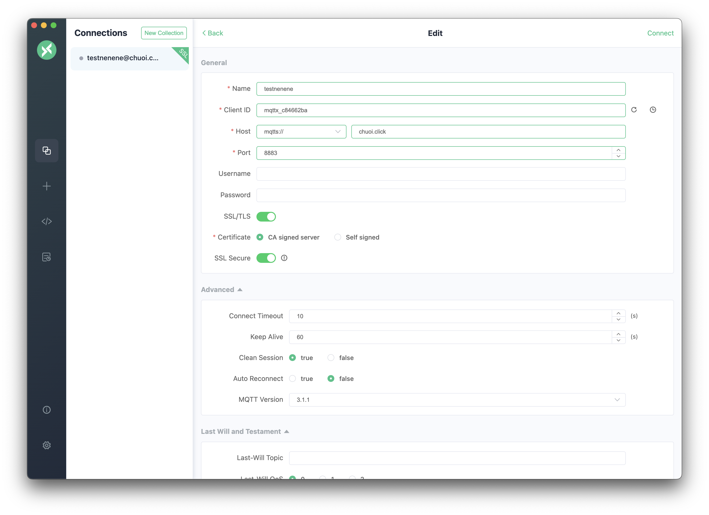
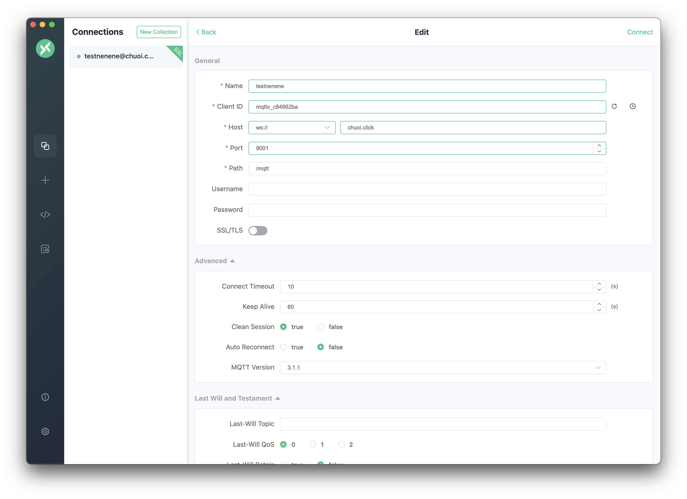
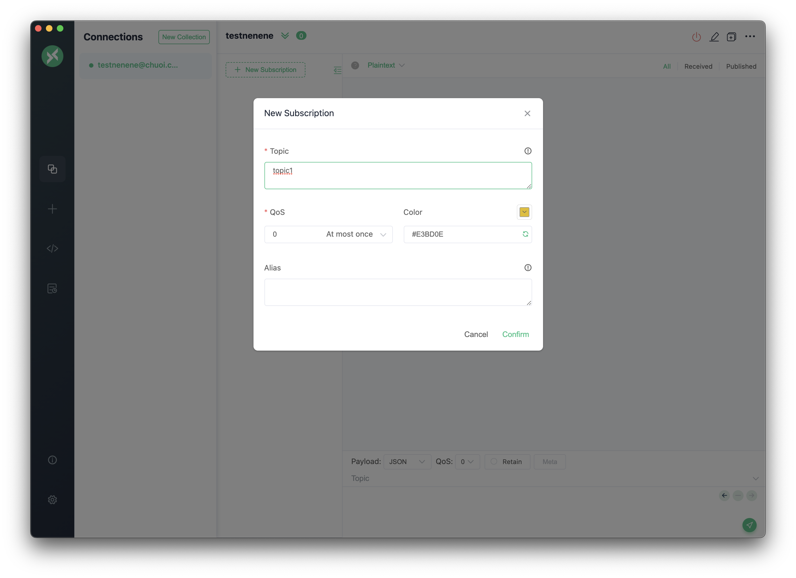
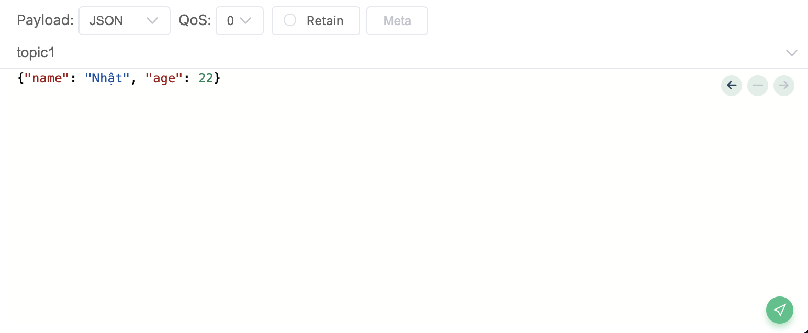
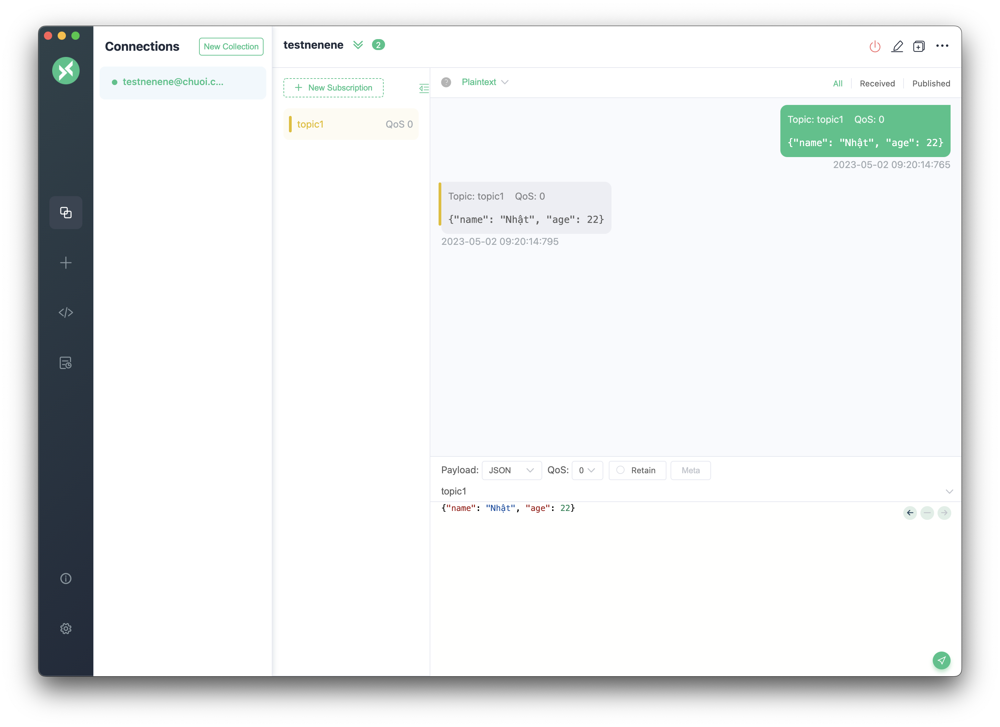

Tiếp nối sự "thành công" (hoặc thất bại, vì mình không rõ 🌚) của stack "Nginx cùng SSL", bài viết này mình sẽ đề cập tới `Mosquitto`, một ứng dụng rất phổ biến để triển khai một _message broker_ (môi trường trung gian) cho các ứng dụng sử dụng giao thức `MQTT` (Message Queuing Telemetry Transport) - nếu các bạn chưa rõ `MQTT` kà gì hay sự khác nhau giữa nó và `HTTP` thì search chị Google ngay nhé 😁.

Tất nhiên bài viết này mình sẽ đề cập với cài `Mosquitto` trên môi trường `Docker` và đặc biệt như tiêu đề, sẽ có thêm config cho phần **SSL** tương tự như stack trước (phần này là optional, nên mình mới để quả title như vậy đấy 👀).

## Vấn đề

Thật ra khi lựa chọn _tự cài đặt_ hoặc _tìm kiếm một **MQTT broker** free_ (từ sau mình sẽ viết gọn là **_broker_** nhé), mình hay nhiều bạn khác sẽ lựa chọn giải pháp thứ hai (tất nhiên là cho các project nhỏ, không cần stability hay project cho việc test, vọc vạch,...).

Sau một thời gian làm một vài project như thế, mình thường xuyên gặp phải tình trạng disconnect với _broker_.
Và hiển nhiên không có gì để chê trách cả, nhưng nó khá là gây khó chịu cho mình do các project của mình thường làm liên quan đến IoT như điều khiển từ xa, cảnh báo,... việc disconnect sẽ làm mất đi tính ổn định của sản phẩm đầu ra (thử tưởng tượng lúc demo đồ án cho các thầy mà cái mqtt nó không nhận, khá thốn đấy 😅).

Nếu không muốn sử dụng giải pháp dùng _broker_ free, các bạn thường có các lựa chọn:

1. Sử dụng _broker_ có sẵn nhưng tính phí, ví dụ như [CloudMQTT](https://www.cloudmqtt.com/), [HiveMQ](https://www.hivemq.com/), [EMQ](https://www.emqx.io/),...
2. Tự cài đặt _broker_ trên một máy tính hay VPS nào đó, ví dụ như [Mosquitto](https://mosquitto.org/), [EMQ](https://www.emqx.io/),...
3. Cũng là tự cài đặt, nhưng sẽ trên `Docker` (nội dung của bài viết này 😎).

Nhìn qua các giải pháp, các bạn cũng thừa biết ưu nhược điểm của từng thằng rồi đúng không? Vì vậy mình sẽ bắt tay vào thực hành luôn nhé 😁.

:::tip

Nếu các bạn vẫn muốn tham khảo các _broker_ free, thì mình suggest bọn này nhé:

- [HiveMQ](https://www.hivemq.com/)
- [Emqx](https://www.emqx.io/) (recommended 😎)

:::

## Vào việc nào

### Các yêu cầu cần thiết

1. Có một máy tính hay VPS chạy được **Docker** và **Docker Compose** (mình sẽ không hướng dẫn cài đặt ở đây, các bạn có thể tìm kiếm trên google), và nếu đã tập tành đến những config, hay tương lai làm _devops_ mình khuyên các bạn làm trên các máy tính chạy **Linux**, **Ubuntu**,... sẽ dễ dàng hơn (và ngầu hơn nữa 😎) - (copy y nguyên bài trước, mong các bạn bỏ qua 🌚).
2. Config SSL cho domain của bạn, mình sẽ không hướng dẫn ở đây, các bạn có thể tìm kiếm trên google cho nóng nhé :D.

:::info
Mục thứ 2 là optional, nhưng nếu có các bạn sẽ thấy nó khá hữu ích đấy, ví dụ với case deploy một cái web đơn giản cần connect trực tiếp với _broker_ lên một **hosting service** support **SSL** (như **Firebase**, **Vercel**) sẽ yêu cầu kết nối bằng giao thức **wss** (websocket secure), và nếu các bạn không có SSL thì sẽ không thể connect được (mình đã dính chưởng nên mới mạnh dạn bỏ ít đô mua cái cert 🥲).
:::

:::tip

Nếu có điều kiện, các bạn nên kiếm một con VPS ram tầm 4GB để vọc vạch, cũng như trỏ domain các thứ dễ dàng hơn nhé

:::

### Cấu trúc thư mục

```
.
├── docker-compose.yml
├── config
│   └── mosquitto.conf
├── data
├── log
└── certs
    ├── cert.pem
    ├── cacert.pem
    └── private.key
```

- `docker-compose.yml`: file config cho docker-compose.
- `mosquitto.conf`: file config cho `mosquitto` (cucky quan trọng nhé :))).
- `certs`: thư mục chứa cert SSL (tùy vào nhà cung cấp SSL mà các bạn có thể nhận được nhiều file khác nhau, ở bài này mình sẽ sử dụng 3 file `cert.pem`, `cacert.pem`, `private.key`, các bạn có thể setup lại tên và nhớ sửa trong file config trên là được).
- `data` và `log`: thư mục chứa data và log của `mosquitto` (được map từ **container** ra nên các bạn không cần care thằng này).

### File mosquitto.config

```bash
# 3 dòng tiếp theo là optional nhé, trong trường hợp các bạn không cần log
persistence true
persistence_location /mosquitto/data/
log_dest file /mosquitto/log/mosquitto.log

# Listener cho MQTT (unencrypted)
listener 1883

# Listener cho MQTTS (encrypted)
listener 8883
certfile /mosquitto/certs/cert.pem
cafile /mosquitto/certs/cacert.pem
keyfile /mosquitto/certs/private.key

# Listener cho WebSocket (unencrypted)
listener 9001
protocol websockets

# # Listener cho WebSocket Secure (encrypted)
listener 9002
protocol websockets
certfile /mosquitto/certs/cert.pem
cafile /mosquitto/certs/cacert.pem
keyfile /mosquitto/certs/private.key
tls_version tlsv1

# Allow access from anywhere
allow_anonymous true
```

File config trên mình đã config cho 4 giao thức kết nối được tới _broker_:

- `mqtt`: port `1883` là thằng cơ bản nhất, không cần cert.
- `mqtts`: port `8883` là thằng `mqtt` nhưng có SSL.
- `ws`: port `9001` là thằng `mqtt` nhưng dùng giao thức `websocket`.
- `wss`: port `9002` là thằng `websocket` nhưng có SSL.

Các bạn có thể thay đổi các port trên theo ý mình, nếu sửa port thì cũng sửa map port trong `docker-compose.yml` nhé.

Ngoài ra nếu các bạn muốn dùng username, password để connect tới _broker_ thì các bạn có thể thay thằng `allow_anonumous true` bằng config sau vào file trên:

```bash
# Require username and password
allow_anonymous false
password_file /mosquitto/config/passwd
```

Và tạo file `passwd` trong thư mục `config` với nội dung như sau:

```bash
# username:password
admin:passwordsieuKho@123
```

### File docker-compose

```yaml
version: '3'

services:
  mosquitto:
    image: eclipse-mosquitto:latest
    container_name: mosquitto
    restart: always
    ports:
      - '1883:1883'
      - '8883:8883'
      - '9001:9001'
      - '9002:9002'
    volumes:
      - ./config:/mosquitto/config
      - ./log:/mosquitto/log
      - ./data:/mosquitto/data
      - ./certs:/mosquitto/certs
    environment:
      - TZ=Asia/Ho_Chi_Minh
    networks:
      - mosquitto

networks:
  mosquitto:
    driver: bridge
```

Image mình sử dụng trong stack này sẽ là `eclipse-mosquitto`, các bạn có thể thay bằng image khác nhưng mình khuyên các bạn nên dùng image này vì nó là image chính thống của `mosquitto` và được cập nhật thường xuyên.

File _compose_ trên mình config 4 mapping cho thằng _volumes_:

- `config`: thư mục chứa file config của `mosquitto`.
- `log`: thư mục chứa file log của `mosquitto`. (optional)
- `data`: thư mục chứa data của `mosquitto`. (optional)
- `certs`: thư mục chứa các file cert SSL. (optional)

:::info

3 cái mapping volumes mình để optional trong trường hợp các bạn không cần logging, hay không cần các giao thức secure, và tất nhiên nếu không cần secure thì có thể bỏ luôn 2 mapping port tương ứng của `mqtts` và `wss` nhé (trong trường hợp này là port `8883` và `9002`)

:::

## Demoooo

Để chạy service vào tạo, các bạn mở terminal và gõ:

```bash
docker-compose up -d
```

Sau khi chạy xong, các bạn có thể dùng vài app để test cho nhanh, mình recommend thằng [MQTTX](https://mqttx.app/) cho các bạn, nó có giao diện đẹp, dễ dùng, và nó còn hỗ trợ cả giao thức `websocket` nữa, các bạn có thể tải về và cài đặt, sau đó mở lên và config như sau:

### Có SSL



### Không có SSL



:::tip

Ở demo1 thì mình sử dụng `mqtts`, ở demo2 mình sử dụng `ws`, và với `wss` các bạn config tượng tự như `mqtts`, `mqtt` thì config tương tự `ws` nhé.

:::


Subscribe topic có tên `topic1`


Thử public đến topic `topic1` với một message kiểu json

```json
{ "name": "Nhật", "age": 22 }
```


Ở khu vực xem message, các bạn dễ dàng thấy một message gửi đi (publish) và đồng thời có message trả về (do đã subscribe), vậy chứng tỏ _broker_ của mình đã hoạt động ok 😎

## Kết

Đây là hướng dẫn rất basic, vì vậy có thể nó chưa phù hợp với project thực tế, nhưng mình nghĩ nó sẽ giúp các bạn hiểu được cách hoạt động của `mosquitto` và cách config cơ bản nhất cho nó.

Ngoài ra, các bạn rất nên tìm hiểu thêm các thuộc tính để cấu hình cho `docker-compose`, hay cho `mosquitto` để có thể tùy biến cho phù hợp với project của mình.

Và, source code example mình vẫn để trên repo này nhé:

[https://github.com/buiducnhat/useful-docker-stacks/tree/main/mosquitto-with-ssl](https://github.com/buiducnhat/useful-docker-stacks/tree/main/mosquitto-with-ssll)

## Tham khảo

- [https://docs.docker.com/compose/](https://docs.docker.com/compose/)
- [https://hub.docker.com/\_/eclipse-mosquitto](https://hub.docker.com/_/eclipse-mosquitto)
- [https://mosquitto.org/man/mosquitto-conf-5.html](https://mosquitto.org/man/mosquitto-conf-5.html)
