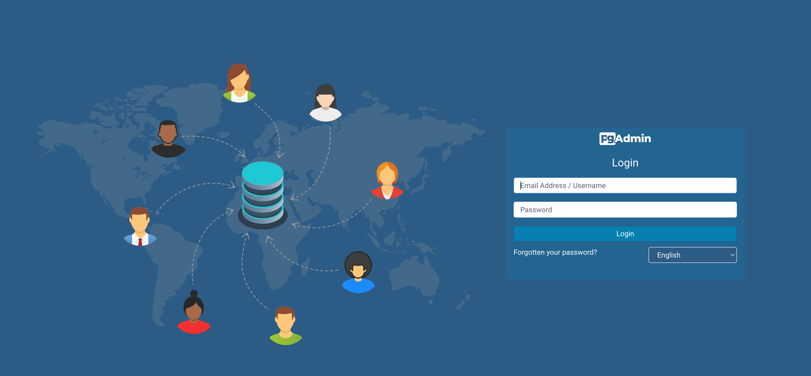

## Mở bài

Database hẳn không còn là khái niệm xa lạ với bất kỳ ai làm việc trong lĩnh vực lập trình, hay rộng hơn là IT. Về cơ bản xu hướng hiện nay có 2 loại database chính là **SQL** và **NoSQL**.

Nhớ lại sầu, khi mới chập chững vào con đường làm Backend developer, mình phải cài hết phần mềm này đến phần mềm khác, cài từ IDE cho tới môi trường code, cài framework, và có lẽ "hơi ám ảnh" nhất là cài đống database trên chính con laptop già yêu của mình.

Cụ thể hơn thì mình bắt đầu với MySQL vì thằng này khá nhẹ, dễ cài, và khá lâu đời, nhưng đống package đi kèm với nó, rồi đồng app, client để quản lý,... khá là nhiều, đến mức khi uninstall mình cũng không gỡ nổi hết =))). Đấy còn chưa kể đến thằng MS SQL Server, con đẻ của Mai crô sốp, nó đẻ ra phải gọi là đống app luôn, vào Control panel trên con Windows gỡ lòi mắt 🥹 (một lần bất đắc dĩ phải cài vì môn thực hành trên trường R Heart).

## Tại sao lại là Postgresql

Về database loại SQL thì phổ biến có MySQL, SQL Server, Oracle, Postgresql,... . Tuy nhiên tiêu chí của mình thường lựa những thằng free, opensource, cộng đồng support lớn, và update thường xuyên, vì vậy Postgresql là một lựa chọn tuyệt vời.

Ngoài ra bạn có thể vào trang chủ của nó để xem sự khác biệt của nó so với các loại database khác nhé: [https://www.postgresql.org/](https://www.postgresql.org/).

## Vào việcccc

Ở bài này, mình sẽ không nêu yêu cầu để thực hiện nữa, các bạn chịu khó xem bài trước [tại đây](../nginx-cung-ssl/#các-yêu-cầu-cần-thiết) nhé.

### Cấu trúc thư mục

```
.
├── docker-compose.yml
├── postgresql.conf
├── .env
└── nginx
    ├── nginx.conf
    └── certs
        ├── cert.crt
        └── private.key
```

### docker-compose.yml

Vẫn là start với file docker-compose thần thánh:

```yml
version: '3.7'

services:
  postgresql:
    image: postgres:latest
    container_name: postgresql
    restart: unless-stopped
    networks:
      - pg
    env_file:
      - ./.env
    ports:
      - 5432:5432
    volumes:
      - ./postgresql.conf:/etc/postgresql/postgresql.conf:ro
      - /etc/localtime:/etc/localtime:ro
      - ./data/postgresql:/var/lib/postgresql/data

  pgadmin:
    image: dpage/pgadmin4:latest
    container_name: pgadmin
    restart: unless-stopped
    networks:
      - pg
    depends_on:
      - postgresql
    env_file:
      - ./.env
    ports:
      - '8080:80'

  pgadmin-proxy:
    image: nginx:stable-alpine
    container_name: pgadmin-proxy
    restart: unless-stopped
    networks:
      - pg
    depends_on:
      - pgadmin
    ports:
      - '8443:443'
    volumes:
      - ./nginx/nginx.conf:/etc/nginx/nginx.conf:ro
      - ./nginx/certs:/etc/nginx/certs

networks:
  pg:
    driver: bridge
```

Wait... sao có tận 3 service nhỉ?

### postgresql

Đầu tiên là **postgresql**, sure rồi vì là phần chính của bài này mà, chúng ta cứ áp postgres bản latest nhé (ở thời điểm viết bài là ver 15), các bản khác các bạn có thể xem tại [đây](https://hub.docker.com/_/postgres/tags).

Về phần `.env`, ở đây mình sẽ config các biến môi trường quan trọng cho postgres như sau:

```bash
POSTGRES_USER=xxxuserxxx
POSTGRES_PASSWORD=xxxpasswordxxx
POSTGRES_DB=postgres
PGDATA=/var/lib/postgresql/data/pgdata
```

đọc các biến `POSTGRES_USER`, `POSTGRES_PASSWORD`, `POSTGRES_DB` chắc ai cũng đoán được mục đích rồi nhỉ, đấy là user root đầu tiên của postgres, password của user đó, và tên database mặc định khi khởi tạo, cái này các bạn nhớ dấu kỹ và đừng để lộ nhé 😁.

Ngoài ra còn có biến `PGDATA` để config đường dẫn lưu trữ data của postgres, nếu không muốn custom thì các bạn có thể skip thằng này nhé, lý do sử dụng của mình là để mapping với volumes bên ngoài, để khi xóa container đi, data vẫn được giữ lại.

```yml
# Dòng này để mapping data của postgres với thư mục ngoài là ./data/postgresql
# (tại thư mục gốc của project), "ro" là read-only (chỉ đọc)
- ./postgresql.conf:/etc/postgresql/postgresql.conf:ro
```

Về 2 mapping volumes còn lại:

- `/etc/localtime:/etc/localtime:ro`: mapping thư mục `/etc/localtime` của host với thư mục `/etc/localtime` của container, để đồng bộ múi giờ giữa host và container.
- `./postgresql.conf:/etc/postgresql/postgresql.conf:ro`: mapping file `postgresql.conf` của host với file `postgresql.conf` của container, để config postgres, về chi tiết các config các bạn đọc thêm tài liệu nhé, nên phần này hoàn toàn có thể skip, optional.

### pgAdmin

**pgAdmin** là một công cụ quản lý và phát triển mã nguồn mở phổ biến nhất và đầy đủ tính năng nhất cho PostgreSQL
Trang chủ: [https://www.pgadmin.org/](https://www.pgadmin.org/)


Để dễ hiểu, các bạn chỉ cần cài dặt pgAdmin là có ngay một GUI client để quản lý, truy vấn, vân vân mà mây mây với bất cứ database Postgresql nào (sure là phải có authen rồi hehe).

Các bước cài đặt pgAdmin: đơn là như file compose trên, map port 80 của container pgAdmin với port 8080 của host, và config các biến môi trường như sau:

```bash
PGADMIN_DEFAULT_EMAIL=xxxemailxxx
PGADMIN_DEFAULT_PASSWORD=xxxpasswordxxx
```

đây là user superadmin để chúng ta login lần đầu vào pgAdmin nhé.



### pgadmin-proxy hay nginx (optional)

Như ở trên, **pgAdmin** sẽ chạy như một web app, và hoàn toàn có thể public ra internet và truy cập từ bất cứ trình duyệt nào. Vì vậy nếu bạn nào muốn vọc vạch, kết hợp kiến thức từ bài viết trước: [Nginx cùng SSL](../nginx-cung-ssl) thì có thể config thêm **nginx** để proxy cho pgAdmin nhé.

Về cơ bản chúng ta sẽ proxy_pass cái web pgAdmin đang chạy, cụ thể khi cùng một network như trên (network `pg`), container chạy **nginx** có thể truy cập tới container chạy **pgAdmin** qua địa chỉ `http://pgadmin:80`, vì vậy chúng ta chỉ cần config như sau:

```conf
# nginx.conf

events {
}

http {
    server {
        listen 443 ssl;
        server_name your-domain.com;

        ssl_certificate /etc/nginx/certs/cert.crt;
        ssl_certificate_key /etc/nginx/certs/private.key;

        location / {
            proxy_pass http://pgadmin:80;

            proxy_set_header    Host                $http_host;
            proxy_set_header    X-Real-IP           $realip_remote_addr;
            proxy_set_header    X-Forwarded-Proto   $scheme;
            proxy_set_header    X-Forwarded-For     $proxy_add_x_forwarded_for;

            proxy_http_version 1.1;
            proxy_set_header Connection "";
        }
    }
}
```

về các config liên quan đến **SSL**, hay các file **certs**, các bạn đọc kỹ ở [bài trước](/series/chay-moi-thu-voi-docker/nginx-cung-ssl/) nhé! Ở đây ta chỉ cần để ý đến `proxy_pass http://pgadmin:80;` (tất nhiên `pgadmin` hay`:80` sẽ tương ứng với port chạy của container **pgAdmin** cũng như tên của container các bạn đặt nhé).

## Trải nghiệm thôi

Command thần thánh để run một đống kia cùng lúc 😎

```bash
docker-compose up -d
```

sau đó các bạn có thể truy cập đường dẫn `https://your-domain.com:8443` để vào pgAdmin nếu config proxy và SSL, còn nếu không config proxy thì truy cập đường dẫn `http://localhost:8080` nhé.

Sau đó login với user và password đã config ở trên, và tận hưởng thôi 😁

Về phần cách sử dụng, hay chi tiết về tạo db, tạo table, truy vấn,.... các bạn tự tìm hiểu về SQL nhé (mà mình tin những bạn đọc bài nếu chắc đều có kiến thức về SQL, database rồi 😁).

## Kết bài

Mình tin rằng bài viết này hữu ích cho anh em đang tập tành dev backend mà không có điều kiện thuê database trên cloud nhưng không muốn cài quá nhiều package, môi trường của đống database kia vào máy mình, hay đơn giản là muốn tự tạo một database để vọc vạch, học hỏi, và làm việc.

Ngoài ra ở production, chúng ta nên limit cái pgAdmin lại nhé, vì dù gì qua web app mà public, ai cũng truy cập được thì nó vẫn hơi.... kém an toàn :D.

Tạm biệt các bạn, hẹn gặp lại ở những bài sau nhé....!

## Tham khảo và liên kết

- [https://www.postgresql.org/](https://www.postgresql.org/)
- [https://www.pgadmin.org/](https://www.pgadmin.org/)
- [https://hub.docker.com/\_/postgres](https://hub.docker.com/_/postgres)
- [https://hub.docker.com/r/dpage/pgadmin4](https://hub.docker.com/r/dpage/pgadmin4)
- [https://nginx.org/en/docs/](https://nginx.org/en/docs/)
