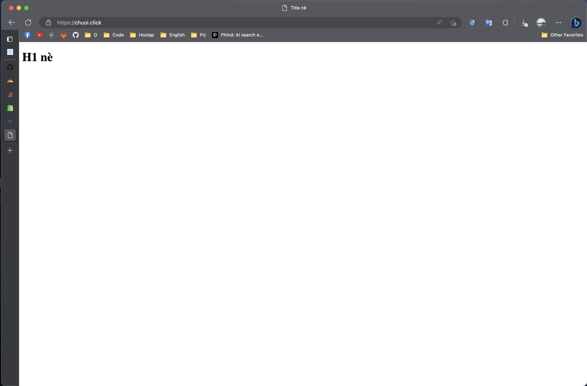

Đây sẽ là stack đầu tiên mình muốn giới thiệu, nên cũng là stack khá đơn giản và phổ biến mà các dev hay sử dụng. Nó sẽ giúp bạn deploy các ứng dụng web của mình lên một **machine** (máy tính) một cách nhanh chóng và dễ dàng.

## Vấn đề

Chỉ cần search google với từ khóa như _"config nginx with docker"_ chẳng hạn, các bạn sẽ gặp không ít tutorial hướng dẫn chi tiết từ A-Z, từ config cho việc serve static files cho đến proxy các request đến các ứng dụng web khác.

Tuy nhiên khi deploy một _webserver_ thực tế, thì người ta sẽ mua _domain_ (tên miền), mua cert _SSL_ (chứng chỉ bảo mật) để có thể truy cập vào _webserver_ bằng `https`, hay các giao thức tương tự khác như `mqtts`, `wss`,.... Và đây là vấn đề mà các tutorial trên không hoặc ít đề cập đến, dẫn đến việc nhiều bạn thuê **VPS**, mua _domain_ xong gặp khó khăn khi config chúng với SSL, thành ra lại quay lại config một cách thủ công.

## Vào việc nào

Đặt vấn đề hơi dài dòng một chút nhưng mình muốn độc giả hiểu được lí do mình muốn chia sẻ bài viết này 😁. Vậy mình cùng vào việc ngay thôi!!!

### Các yêu cầu cần thiết

1. Mua _domain_ (recommend) và cert _SSL_ (bắt buộc với bài viết này =)))
2. Có một máy tính hay VPS chạy được **Docker** và **Docker Compose** (mình sẽ không hướng dẫn cài đặt ở đây, các bạn có thể tìm kiếm trên google), và nếu đã tập tành đến những config, hay tương lai làm _devops_ mình khuyên các bạn làm trên các máy tính chạy **Linux**, **Ubuntu**,... sẽ dễ dàng hơn (và ngầu hơn nữa 😎).
3. Nhớ trỏ **domain** về IP của máy bạn sử dụng, để nhìn thực tế hơn nhé 😁.
4. Config SSL cho domain của bạn, mình sẽ không hướng dẫn ở đây, các bạn có thể tìm kiếm trên google, hoặc có thể sử dụng [Let's Encrypt](https://letsencrypt.org/) hay [Cloudflare](https://www.cloudflare.com/),... để có thể tạo cert SSL miễn phí.

:::tip

Nếu có điều kiện, các bạn nên kiếm một con VPS ram tầm 4GB để vọc vạch, cũng như trỏ domain các thứ dễ dàng hơn nhé

:::

### Cấu trúc thư mục

```
.
├── docker-compose.yml
├── nginx.conf
├── index.html
└── certs
    ├── cert.crt
    └── private.key
```

- `docker-compose.yml`: file config cho docker-compose.
- `nginx.conf`: file config cho nginx.
- `index.html`: file html đơn giản để test (serve static files).
- `certs`: thư mục chứa cert SSL (tùy vào nhà cung cấp SSL mà các bạn có thể nhận được nhiều file khác nhau, như tên file khác hoặc ext của nó là `.pem`, các bạn có thể đổi tên chúng hoặc config theo ý mình trong file `nginx.conf` nhé).

### File nginx.config

Ở đây mình sẽ ghi đè luôn config mặc định của **nginx**, hoặc các bạn có thể tạo thêm các file trong `sites-available` và `sites-enabled` để config cho từng _domain_ khác nhau, mình sẽ không hướng dẫn ở đây, các bạn có thể tìm kiếm trên google nhé.

```nginx
events {
}

http {
    server {
        listen 80;
        server_name your.domain;
        return 301 https://$host$request_uri;
    }

    server {
        listen 443 ssl;
        server_name your.domain;

        ssl_certificate /etc/nginx/certs/cert.crt;
        ssl_certificate_key /etc/nginx/certs/private.key;

        location / {
            root /usr/share/nginx/html;
            index index.html index.htm;
            try_files $uri $uri/ /index.html;
        }
    }
}
```

Ở file trên, mình config 2 server, một server để redirect các request từ `http` (port 80) sang `https` (port 443), và một server để serve các file tĩnh (static files) từ thư mục `/usr/share/nginx/html` (thư mục mặc định của nginx).

Ngoài ra, mình cũng config SSL cho server này, các bạn có thể thay đổi đường dẫn đến cert SSL của mình ở đây (nhớ là liên quan đến bước config trong `docker-compose` nữa nhé).

### File docker-compose

```yaml
version: '3'

services:
  nginx:
    image: nginx:stable-alpine
    restart: always
    ports:
      - '80:80'
      - '443:443'
    volumes:
      - ./certs:/etc/nginx/certs
      - ./nginx.conf:/etc/nginx/nginx.conf
      - ./index.html:/usr/share/nginx/html/index.html
```

Ở file trên, mình config một service `nginx` với image là `nginx:stable-alpine` (các bạn có thể thay đổi version của nginx, hoặc sử dụng image khác như `nginx:latest`,...), và các bạn có thể thay đổi các config khác như `restart`, `ports`, `volumes`,... theo ý mình, tuy nhiên default thì mình sẽ map port 80 sang 80, 443 sang 443.

Ở phần `volumes`, mình mount thêm 2 file `nginx.conf` và `certs` vào container, để có thể config cho nginx và sử dụng cert SSL, nếu các bạn chỉnh path của các file `cert` hay file `config`, file `html` thì nhớ chỉnh ở cả `docker-compose` và `nginx.conf` nhé.

### File index.html

```html
<!DOCTYPE html>
<html lang="en">
  <head>
    <meta charset="UTF-8" />
    <meta http-equiv="X-UA-Compatible" content="IE=edge" />
    <meta name="viewport" content="width=device-width, initial-scale=1.0" />
    <title>Title nè</title>
  </head>
  <body>
    <h1>H1 nè</h1>
  </body>
</html>
```

:::tip
Nếu dùng **VSCode**, các bạn tạo file **html** xong, gõ `!` rồi `Enter` để tạo nhanh file html như trên nhé 😁.
:::

### Chạy thử luôn nào!!!

Để chạy service vào tạo, các bạn mở terminal và gõ:

```bash
docker-compose up -d
```

Sau khi chạy xong, các bạn truy cập vào domain của mình, nếu thấy hiện ra như thế này là thành công rồi nhé 😁.



Như các bạn đã thấy, mình có config cho domain `chuoi.click`, và khi vào browser, nó sẽ hiện hình cái khóa trước địa chỉ, như vậy là config SSL thành công rồi nhé 😁.

## Kết

Đây là hướng dẫn rất rất basic, vì vậy có thể nó chưa phù hợp với app thực tế, chủ yếu để các bạn tập làm quen với các khái niệm cơ bản của **docker** và **docker-compose**, cũng như map volumes, hay biết các bước cần thiết để deploy một ứng dụng web có SSL.

:::note
Ngoài serve file HTML như trên, các bạn hoàn toàn có thể proxy các request đến các service khác như `nodejs`, `php`,... hoặc các bạn có thể tạo thêm các file config khác trong `sites-available` và `sites-enabled` để config cho từng _domain_ khác nhau, nếu muốn thử thì coi như là bài tập thực hành nhé 😁.
:::

## Tham khảo

- [https://docs.docker.com/compose/](https://docs.docker.com/compose/)
- [https://docs.nginx.com/nginx/admin-guide/web-server/serving-static-content/](https://docs.nginx.com/nginx/admin-guide/web-server/serving-static-content/)
